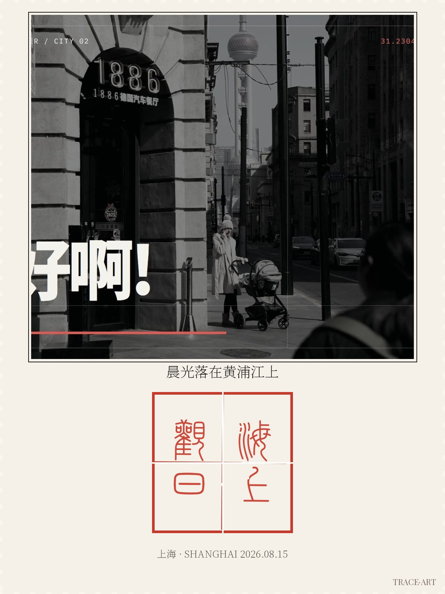
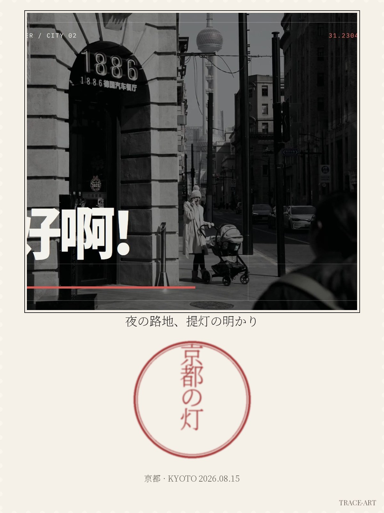
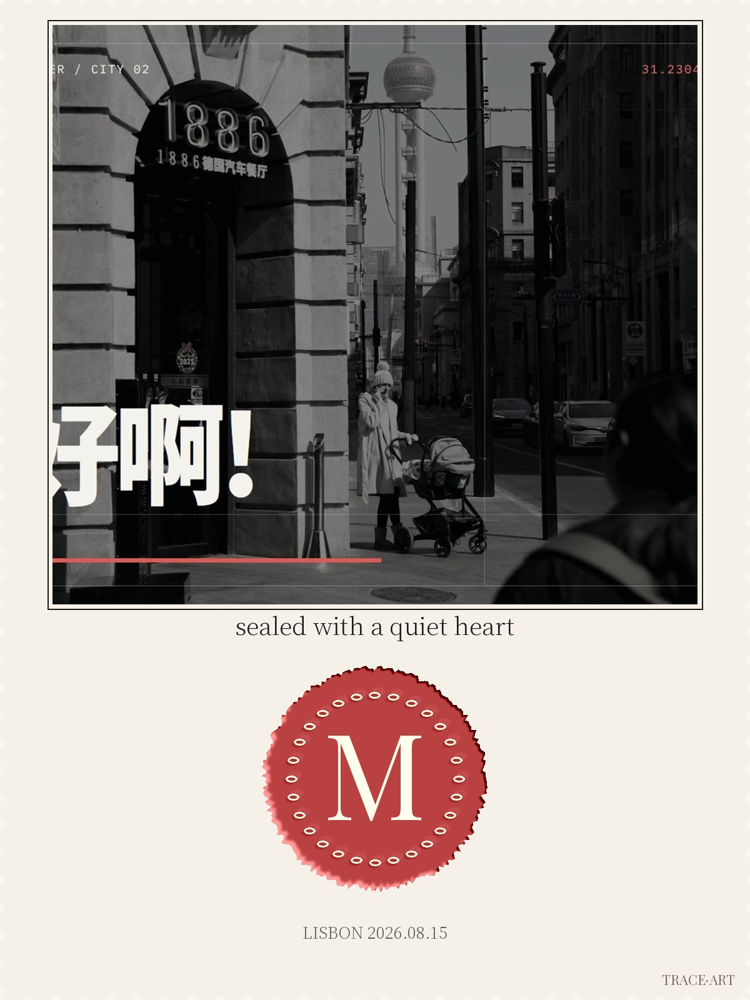

# TraceMark

> Trace every mark. Turn a photo into a stamped postcard — Chinese seal-carving, Japanese town-stamp, Western wax seal. Three cultures, one generation.

**Choose your language**:
**[English](docs/en.md)** · [简体中文](docs/zh-hans.md) · [繁體中文](docs/zh-hant.md) · [粵語](docs/yue.md) · [日本語](docs/ja.md) · [Français](docs/fr.md)

Each language gets a full standalone page — links stay stable as content grows.



*Track zh — a photo of Shanghai at dawn, stamped with a vermilion zhuan seal 「海上观日」: square grid, right-column-first reading order, jinshi dry-brush texture, perforated postcard edge. (Code-rendered output.)*



*Track jp — a sumi-ink circular craft stamp 「京都の灯」 on a perforated postcard: enso-style ink ring, ink mist halo. (Code-rendered output.)*



*Track wz — an embossed crimson wax seal with a monogram flourish on letterpress cotton paper, perforated edge. (Code-rendered output.)*

---

## What is TraceMark

TraceMark is an agent skill: give it a photo and a one-line theme, it renders a 1200×1600 stamped art postcard. Pure PIL deterministic rendering — **text is always typeset correctly** (missing glyphs are detected against the font's real cmap and rejected, never silently replaced); the whole pipeline runs locally, photos never leave your machine.

Quick start — one entry point, every pipeline step is mandatory:

```bash
git clone https://github.com/Fanjiale-CN/tracemark.git
cd tracemark
# 1. health check (dependencies, fonts, write directory)
python3 scripts/tracemark.py doctor
# 2. render (edit config.yaml text/track/template to change theme)
python3 scripts/tracemark.py render --config examples/shanghai-sunrise/config.yaml
# → examples/shanghai-sunrise/output.jpg  (+ output.tracemark.json audit sidecar)
# 3. seal-only output (--no-photo; still carries perforation + TRACE·ART)
python3 scripts/tracemark.py render --config examples/shanghai-sunrise/config.yaml --no-photo
```

One YAML configures a case (`examples/shanghai-sunrise/config.yaml`): `text` is the seal text, `track` picks `zh|jp|wz`, `template` picks a layout (zh-square-zhu, zh-square-bai, zh-circle-leisure, jp-circle-stamp, wz-wax-monogram), `seed` controls stamp randomness, `photo` set to null skips the photo zone.

## Three tracks

| Track | Cultural prototype | Use it for | Example |
| --- | --- | --- | --- |
| zh | Chinese zhuan seal-carving (square grid, right→left reading order) | name / studio / city memories | `examples/shanghai-sunrise` |
| jp | Japanese eki-stamp craft stamp (circular sumi-ink) | travel memories / stationery | `examples/kyoto-lantern` |
| wz | Western wax seal (embossed monogram) | envelopes / weddings / brands | `examples/wax-monogram` |

## Why it looks like this (design stance)

Outputs are **deliberately not real seals**: perforated edges, non-standard layout, a permanent micro-type `TRACE·ART`. That is both an art language and a legal moat — seal laws protect marks usable for authentication, and statute (e.g. the 1970 U.S. postal law's size-difference requirement for stamp reproductions) itself carves out the "artistic difference" safe zone. See AUP.md.

Risk control is **purpose-based**: political expression, public figures, institutions, nations, historical subjects and satire are all allowed in artwork — what is blocked is any *authentication purpose* and the replication of existing official seals. When a request is refused, the guidance explains which purpose was blocked and how to re-frame it. Every render also passes a mandatory post-render audit (size, artification marks, sidecar metadata) that no output can skip.

## File layout

```
SKILL.md            # route table + usage flow (agent entry)
docs/               # six languages, one standalone page each
AUP.md              # purpose-based acceptable use policy, six languages
FONTS.md            # license notes for the three bundled fonts
scripts/tracemark.py       # unified entry point (render/validate/audit/doctor)
scripts/render.py          # compositing engine (zh/jp/wz tracks)
scripts/texture.py         # stamp texture (ink mist / jinshi / wax relief)
scripts/validate_input.py  # purpose-based risk gate (reused by the entry point)
examples/           # input-output paired cases = the regression suite
research/           # three-culture seal studies (design rationale)
gallery/            # real code-rendered outputs used on this page
```

## Contributing

New cases follow the same pairing as `examples/` — submit one input photo + prompt + config + output. The `examples/` directory doubles as the regression eval suite, so every contribution is checked against real outputs.

## Iteration discipline

Each release ships only user-visible change (new template / new texture / new case); see [Releases](../../releases). Pure refactors never headline a changelog.

## License

MIT © 2026 Galok (author attribution — see LICENSE). Font licenses in `FONTS.md` (the seal-script font ships under its author's custom license — no renaming, no trademark use, redistribution must include the license copy with attribution).
