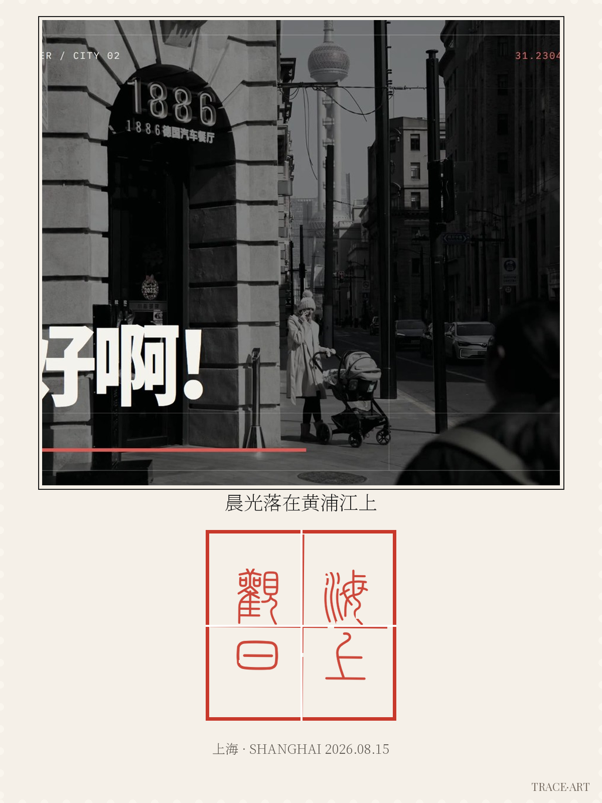

# TraceMark 痕迹追溯

> Trace every mark. 把照片变成盖了章的明信片——中式篆刻、日式町印、西式火漆，三种文化一次生成。

**选择语言 / Choose language / 言語を選択 / Choix de langue：**

| [简体中文](#简体中文) | [繁體中文](#繁體中文) | [粵語](#粵語) | [English](#english) | [日本語](#日本語) | [Français](#français) |
| --- | --- | --- | --- | --- | --- |



---

## 简体中文

TraceMark 是一个 agent skill：给一张照片和一句话主题，生成 1200×1600 的艺术化盖章明信片 PNG。纯 PIL 确定性渲染，**文字永远工整，零生成式乱码**；全流程在本地跑，照片不上传。

**快速开始：**

```bash
git clone https://github.com/Fanjiale-CN/tracemark.git
cd tracemark
python3 scripts/validate_input.py "海上观日" seal
python3 scripts/render.py --config examples/shanghai-sunrise/config.yaml
```

改 `config.yaml` 里的 `text`（印章文字）、`track`（zh|jp|wz）、`seed` 即可换主题。

**三轨道**：zh 中式篆刻（朱文方印·田字格·右→左读序）/ jp 日式町印（圆形墨晕戳）/ wz 西式火漆（蜡封圆印）。风控：印章轨道拒绝公司/机构/政府名并温和引导到明信片轨道；所有成品永久带齿孔边框与 "TRACE·ART" 微字——既是艺术语言，也是法律防线。

---

## 繁體中文

TraceMark 是一個 agent skill：給一張照片和一句話主題，生成 1200×1600 的藝術化蓋章明信片 PNG。純 PIL 確定性渲染，**文字永遠工整，零生成式亂碼**；全流程在本地跑，照片不上傳。

**快速開始：**

```bash
git clone https://github.com/Fanjiale-CN/tracemark.git
cd tracemark
python3 scripts/validate_input.py "海上觀日" seal
python3 scripts/render.py --config examples/shanghai-sunrise/config.yaml
```

改 `config.yaml` 裡的 `text`（印章文字）、`track`（zh|jp|wz）、`seed` 即可換主題。

**三軌道**：zh 中式篆刻（朱文方印·田字格·右→左讀序）/ jp 日式町印（圓形墨暈戳）/ wz 西式火漆（蠟封圓印）。風控：印章軌道拒絕公司、機構、政府名稱並溫和引導至明信片軌道；所有成品永久帶齒孔邊框與 "TRACE·ART" 微字——既是藝術語言，也是法律防線。

---

## 粵語

TraceMark 係一個 agent skill：俾一張相同一句話主題，生成 1200×1600 嘅藝術化蓋章明信片 PNG。純 PIL 確定性渲染，**文字永遠工整，零生成式亂碼**；成個流程喺本地行，相唔會上傳。

**快速開始：**

```bash
git clone https://github.com/Fanjiale-CN/tracemark.git
cd tracemark
python3 scripts/validate_input.py "海上觀日" seal
python3 scripts/render.py --config examples/shanghai-sunrise/config.yaml
```

改 `config.yaml` 入面嘅 `text`（印章文字）、`track`（zh|jp|wz）、`seed` 就可以換主題。

**三軌道**：zh 中式篆刻（朱文方印·田字格·右→左讀序）/ jp 日式町印（圓形墨暈戳）/ wz 西式火漆（蠟封圓印）。風控：印章軌道唔接受公司、機構、政府名稱，會溫和咁引導你轉去明信片軌道；所有成品永久帶齒孔邊框同 "TRACE·ART" 微字——既係藝術語言，亦係法律防線。

---

## English

TraceMark is an agent skill: give it a photo and a one-line theme, and it renders a 1200×1600 artistic stamped-postcard PNG. Purely deterministic PIL rendering — **text is always crisp, zero generative gibberish** — and everything runs locally; your photo never leaves your machine.

**Quick start:**

```bash
git clone https://github.com/Fanjiale-CN/tracemark.git
cd tracemark
python3 scripts/validate_input.py "海上观日" seal
python3 scripts/render.py --config examples/shanghai-sunrise/config.yaml
```

Change `text` (seal text), `track` (zh|jp|wz), and `seed` in `config.yaml` to theme a new output.

**Three tracks**: zh Chinese seal-script square seal (tianzi-grid layout, right-to-left reading order) / jp Japanese circular ink-wash town stamp / wz Western wax-seal monogram. Safety: the seal track refuses company/institution/government names and gently redirects to the postcard track; every output permanently carries a perforation border and "TRACE·ART" microtext — both an artistic language and a legal firewall.

---

## 日本語

TraceMark はエージェントスキルです。写真と一行のテーマを与えるだけで、1200×1600 のアート化スタンプはがき PNG を生成します。純粋に決定的な PIL レンダリングで、**文字は常にきれいに描画され、生成式 AI 特有の文字化けはゼロ**。すべてローカルで実行され、写真は一切アップロードされません。

**クイックスタート：**

```bash
git clone https://github.com/Fanjiale-CN/tracemark.git
cd tracemark
python3 scripts/validate_input.py "海上观日" seal
python3 scripts/render.py --config examples/shanghai-sunrise/config.yaml
```

`config.yaml` の `text`（印章文字）・`track`（zh|jp|wz）・`seed` を変えるだけで新しいテーマにできます。

**三つの軌道**：zh 中国篆刻（朱文方印・田字格・右から左へ）/ jp 日本のはがき印（丸型墨にじみスタンプ）/ wz 西洋ワックスシール（モノグラム）。安全設計：印章モードでは企業・機関・政府の名前は使えません（はがきモードへ優しく誘導します）。すべての生成物には穴あき縁と "TRACE・ART" マイクロテキストが永久的に入ります——芸術言語であると同時に、法的防波堤です。

---

## Français

TraceMark est un skill d'agent : donnez-lui une photo et une phrase-thème, et il rend un PNG de carte postale tamponnée artistique en 1200×1600. Rendu PIL entièrement déterministe — **le texte est toujours net, zéro aberration générative** — et tout s'exécute localement ; votre photo ne quitte jamais votre machine.

**Démarrage rapide :**

```bash
git clone https://github.com/Fanjiale-CN/tracemark.git
cd tracemark
python3 scripts/validate_input.py "海上观日" seal
python3 scripts/render.py --config examples/shanghai-sunrise/config.yaml
```

Modifiez `text` (texte du sceau), `track` (zh|jp|wz) et `seed` dans `config.yaml` pour créer un nouveau thème.

**Trois modes** : zh sceau carré en écriture sigillaire chinoise (grille tianzi, lecture de droite à gauche) / jp cachet circulaire japonais à l'encre estompée / wz sceau de cire occidental à monogramme. Sécurité : le mode sceau refuse les noms d'entreprises, d'institutions et de gouvernements et redirige doucement vers le mode carte postale ; chaque sortie porte en permanence une bordure dentelée et un microtexte "TRACE·ART" — à la fois langage artistique et rempart juridique.

---

## 文件结构 / File structure / Fichiers

```
SKILL.md            # 路由表与使用流程（agent 入口）/ Routing table & workflow (agent entry point)
AUP.md              # 六语可接受使用政策 / Acceptable use policy in six languages
FONTS.md            # 三款字体的许可声明 / Font license notices
scripts/            # 风控校验 + 合成引擎 + 钤印肌理 / Risk control + render engine + texture
examples/           # 输入-输出配对用例，即评测集 / Input-output paired cases (the eval set)
research/           # 三文化印章考据 / Cultural research on the three seal traditions
```

## 迭代纪律 / Iteration discipline

每个 release 只提交用户可见的变化（新模板 / 新肌理 / 新用例）。Changelog 见 [Releases](../../releases)。Each release ships only user-visible changes (new template / new texture / new cases).

## License

MIT © 2026 Galok。字体许可见 `FONTS.md`。Font licenses in `FONTS.md`（峄山碑篆体为作者自定义许可，可再分发须署名 / 峄山碑篆体 carries an author-custom license — redistribution requires attribution）.
