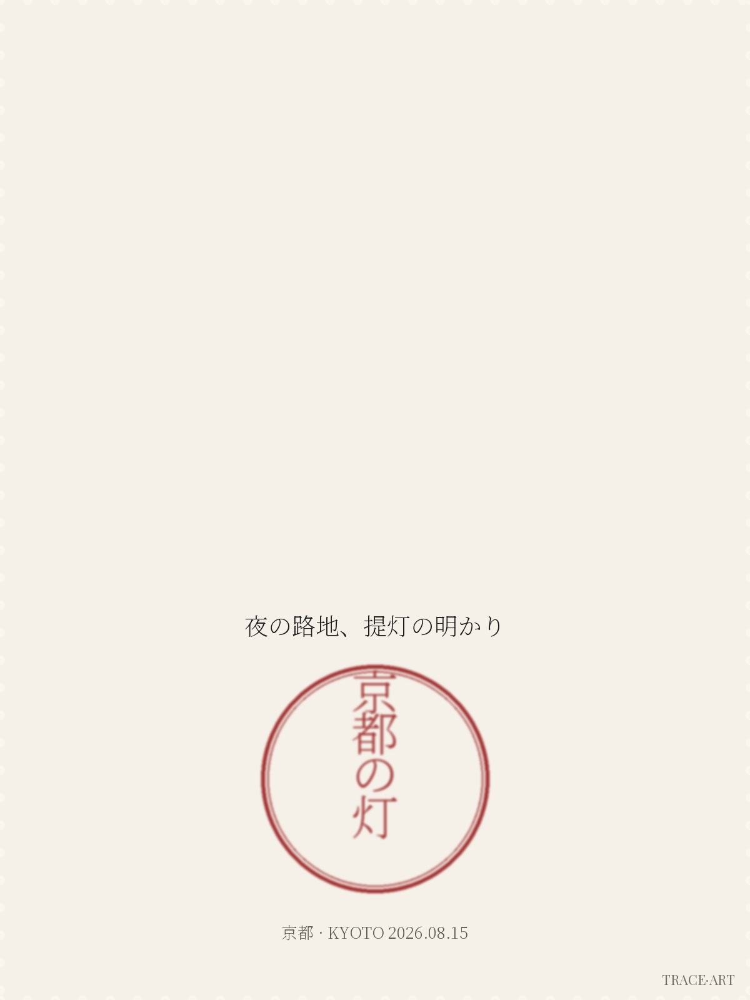
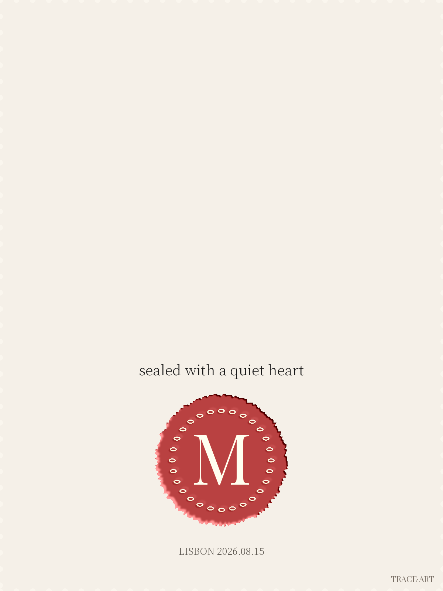

# TraceMark 痕迹追溯

> Trace every mark. 把照片变成盖了章的明信片——中式篆刻、日式町印、西式火漆，三种文化一次生成。






*一张上海照片，三种盖章方式——中式篆刻「海上观日」、日式圆形墨晕戳「京都の灯」、西式火漆浮雕。*

---

## 什么是 TraceMark

TraceMark 是一个 agent skill：给一张照片和一句话主题，生成 1200×1600 的艺术化盖章明信片 PNG。纯 PIL 确定性渲染，**文字永远工整，零生成式乱码**；全流程在本地跑，照片不上传。

## 快速开始

```bash
git clone https://github.com/Fanjiale-CN/tracemark.git
cd tracemark
# 1. 风控校验（任何文字先过这一关）
python3 scripts/validate_input.py "海上观日" seal
# 2. 渲染（改 config.yaml 里的 text/track/seed 即可换主题）
python3 scripts/render.py --config examples/shanghai-sunrise/config.yaml
# → examples/shanghai-sunrise/output.png
```

配置一个用例只需一个 YAML（见 `examples/shanghai-sunrise/config.yaml`）：`text` 是印章文字，`track` 选 `zh|jp|wz`，`seed` 控制钤印随机性，`photo` 留 null 则省略照片区。

## 三轨道

| 轨道 | 文化原型 | 场景 | 成品样例 |
| --- | --- | --- | --- |
| zh 中式篆刻 | 篆刻朱文方印（田字格、右→左读序） | 中文名/斋馆/城市纪念 | `examples/shanghai-sunrise/output.png` |
| jp 日式町印 | スタンプラリー圆形墨晕戳 | 旅行记忆/文具风 | `examples/kyoto-lantern/output.png` |
| wz 西式火漆 | 蜡封 monogram | 信封/婚礼/品牌 | `examples/wax-monogram/output.png` |

## 为什么长成这样（设计立场）

成品**刻意不像真的印章**：齿孔边框、非标准排版、四角永久微字 `TRACE·ART`。这既是艺术语言，也是法律防线：各国印章法保护的是"可用于签署认证的印章"，而法律（如美国 1970 年邮政法对邮票复制品的尺寸差异要求）亲自为"艺术化差异"划了安全区。详情见 AUP.md。

风控分两级：输入校验（seal 轨道拒绝公司/机构/政府名并温和引导到明信片轨道）+ 输出层强制艺术化（任何配置都绕不过边框与微字）。创作者体验不受损——被拒绝时会给出一条路，而不是一个错误。

## 文件结构

```
SKILL.md            # 路由表与使用流程（agent 入口）
docs/               # 六语言完整文档，每种语言独立页面
AUP.md              # 六语可接受使用政策
FONTS.md            # 三款字体的许可声明
scripts/validate_input.py  # 类别可用性风控
scripts/render.py          # 合成引擎（zh/jp/wz 三轨道）
scripts/texture.py         # 钤印肌理（墨晕/金石/火漆浮雕）
examples/           # 输入-输出配对用例，即评测集（贡献新用例按同样结构提交）
research/           # 三文化印章考据
```

## Languages / 語言 / 言語 / Langues

内容会持续增长，每种语言都有独立的完整页面，点击直达：

**[简体中文](docs/zh-hans.md)** · **[繁體中文](docs/zh-hant.md)** · **[粵語](docs/yue.md)** · **[English](docs/en.md)** · **[日本語](docs/ja.md)** · **[Français](docs/fr.md)**

## 迭代纪律

每个 release 只提交用户可见的变化（新模板 / 新肌理 / 新用例），changelog 见 [Releases](../../releases)。纯重构不进 changelog 头条。

## License

MIT © 2026 Galok。字体许可见 `FONTS.md`（峄山碑篆体为作者自定义许可，不可改名、不可注册商标、再分发须附许可副本并署名）。
